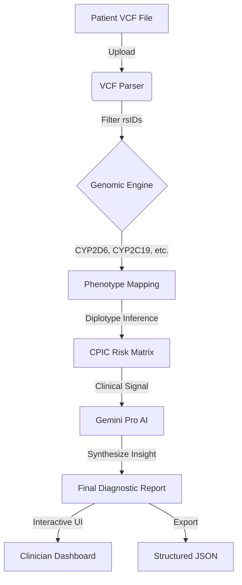

# 🧬 VitalGene AI
### *Precision AI-Powered Pharmacogenomic Clinical Decision Support*

[](https://github.com/Vatsalgoyal7)
[](https://reactjs.org/)
[](https://vitejs.dev/)
[](https://deepmind.google/technologies/gemini/)
[](https://cpicpgx.org/)

---

## 🌟 Overview

**VitalGene AI** is a clinical-grade pharmacogenomics (PGx) analyzer designed to bridge the gap between complex genomic sequencing and actionable clinical decision support. By integrating raw **VCF (Variant Call Format)** parsing with **CPIC-aligned** clinical algorithms and **Generative AI (Gemini Pro)**, it provides healthcare providers with precise medication risk assessments to prevent Adverse Drug Reactions (ADRs).

Predict Risk. Save Lives. Empowering modern medicine with genomic intelligence.

---

## 🚀 Key Features

*   **🔍 High-Fidelity VCF Parsing**: Native support for VCF v4.2 files (up to 5MB). Automatically identifies ClinVar/PharmGKB rsIDs across high-impact pharmacogenes.
*   **⚖️ CPIC & PharmGKB Integration**: Risk assessment logic based on the *Clinical Pharmacogenetics Implementation Consortium* (CPIC) standards, ensuring "Level A" evidence-based dosing.
*   **🧠 Generative Clinical Rationale**: Leverages Google Gemini Pro to synthesize human-readable clinical rationale, explaining the molecular basis for dosing adjustments.
*   **📊 Executive Dashboard**: population-level risk distribution and historical analysis tracking for clinical audits.
*   **🛡️ Stateless & Privacy-First**: All genomic data is processed in-memory. HIPAA-ready architecture ensures zero persistent storage of sensitive genetic files.
*   **📄 EHR-Ready Export**: Structured JSON diagnostic objects tailored for integration with HL7 FHIR or modern Electronic Health Record systems.

---

## 🏗️ Technical Architecture

VitalGene AI operates a high-throughput synchronous pipeline:



---

## 🧰 Technology Stack

-   **Frontend**: React 18 (TypeScript), Vite
-   **Styling**: Vanilla CSS with Glassmorphism / Modern Design Principles
-   **Animations**: Framer Motion
-   **Icons**: Lucide React
-   **AI Intelligence**: Google Gemini Pro API (`@google/genai`)
-   **Genomic Processing**: Custom TypeScript VCF Parser

---

## 🧬 Supported Genes & Medications

The system currently provides Level A clinical guidance for:

| Gene | Medication Class | Example Medications |
| :--- | :--- | :--- |
| **CYP2D6** | Opioids / Pain | Codeine, Tramadol |
| **CYP2C9** | Anticoagulants | Warfarin |
| **CYP2C19** | Antiplatelets | Clopidogrel |
| **SLCO1B1** | Statins | Simvastatin |
| **TPMT** | Immunosuppressants | Azathioprine |
| **DPYD** | Chemotherapy | Fluorouracil (5-FU) |

---

## 🏁 Getting Started

### Prerequisites
- Node.js (v18+)
- NPM or PNPM
- Google Gemini API Key (for clinical rationale generation)

### Installation

1.  **Clone the Repository**
    ```bash
    git clone https://github.com/Vatsalgoyal7/code-nakshatra-2026.git
    cd code-nakshatra-2026
    ```

2.  **Install Dependencies**
    ```bash
    npm install
    ```

3.  **Environment Setup**
    Create a `.env` file in the root:
    ```env
    VITE_GEMINI_API_KEY=your_google_gemini_api_key
    ```

4.  **Run Development Server**
    ```bash
    npm run dev
    ```

---

## 🔒 Data Privacy & Compliance

-   **Zero-Knowledge Storage**: Uploaded genomic files are never written to disk or sent to external servers (except the rsIDs sent to Gemini for rationale generation).
-   **Anonymization**: All patient identifiers (Names, IDs) are stripped before sending metadata to the LLM engine.
-   **Local Processing**: The primary pharmacogenomic mapping happens on the client-side for maximum performance and security.

---

## 👨‍💻 Author

**Vatsal Goyal**
- GitHub: [@Vatsalgoyal7](https://github.com/Vatsalgoyal7)
- Email: vatsalgoyal71@gmail.com
- Organization: Nakshatra 2026

---

## 📄 License

This project is licensed under the MIT License - see the [LICENSE](LICENSE) file for details.

---

> [!IMPORTANT]
> **Medical Disclaimer**: This tool is for research and educational purposes only. It is NOT a diagnostic medical device. Clinical decisions should be made by licensed healthcare professionals.
